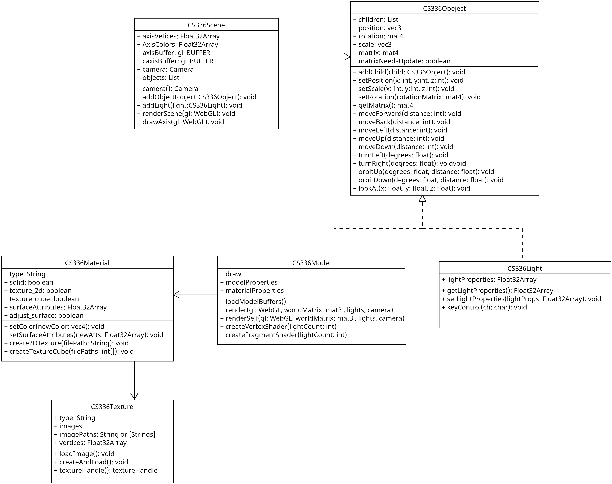

# 336FinalProject
Implementation of the THREE.js functionality built into 336Object. We have extended 
CS336Object with both the CS336Model and the CS336Light. Any of these objects can 
be added to a scene as long as you specify the position, the model you want to use
and the materials you want the model to have. 


# Example Usage 
```
var gl = getGraphicsContext("theCanvas");
const scene = new CS336Scene({ withAxis: true });

function main() {

    const capsule = new CS336Model({
        draw: true, // false if you want a dummy object
        // you have the option of any THREE Geometry  
        modelProperties: getModelData(new THREE.CapsuleGeometry(0.75, 0.75, 10, 10)),
        materialProperties: new CS336Materials("solid"), // can specify "solid", "2D" or "cube"
    });
    capsule.materialProperties.setColor([0.5, 0.5, 0.5, 1.0]);
    capsule.loadModelBuffers();
    capsule.setPosition(0, 0, 0);

    // load 2D texture with path, if you create a new materials object with "2D" 
    // await capsule.materialProperties.create2DTexture(imagePath);

    // load cube texture with image paths, if you create a new materials object with "cube"
    // await capsule.materialProperties.createTextureCube(imagePathsCube)

    // add the object to the scene 
    scene.addObject(capsule);

    /* Optionally add a light (or multiple lights to a scene)
    scene.addLight(new CS336Light({
        x: 0, //position x
        y: 2.5, // position y
        z: 0, // position z
        lightProperties: new Float32Array([
            0.2, 0.2, 0.2, // ambient
            0.7, 0.0, 0.0, // diffuse
            0.7, 0.0, 0.0, // specular
        ])
    }));
    */

    gl.clearColor(0.9, 0.9, 0.9, 1.0);
    gl.enable(gl.DEPTH_TEST);

    const animate = () => {
        scene.renderScene(gl);
        requestAnimationFrame(animate);
    }

    animate();
}
```

# Class Diagram
The diagram itself can be found here: ./documentation/class_diagram.uxf. 
Just add the UMLet extension on VS Code and you will be able to see and edit the diagram. 

